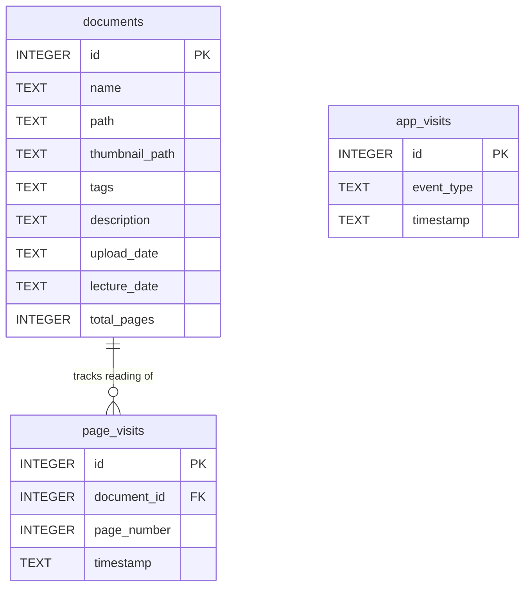

# 🗂️ DocManager — Smart PDF Document Manager

A local-first PDF management system built with Python and Streamlit.  
Upload, tag, search, read, and track your documents — all from your browser.

---

## 📌 Table of Contents

- [🗂️ DocManager — Smart PDF Document Manager](#️-docmanager--smart-pdf-document-manager)
  - [📌 Table of Contents](#-table-of-contents)
  - [🔴 Problem Statement](#-problem-statement)
  - [✅ Solution](#-solution)
  - [✨ Features](#-features)
  - [🛠️ Tech Stack](#️-tech-stack)
  - [📁 Project Structure](#-project-structure)
  - [🏗️ Architecture Overview](#️-architecture-overview)
  - [🔄 Upload Flow](#-upload-flow)
  - [🔍 Search \& Read Flow](#-search--read-flow)
  - [🗄️ Database Design](#️-database-design)
    - [Table Purpose](#table-purpose)
    - [Search Query Logic](#search-query-logic)
  - [📊 Analytics System](#-analytics-system)
    - [Reading Progress Formula](#reading-progress-formula)
  - [🚀 Setup \& Installation](#-setup--installation)
    - [Option A — pip](#option-a--pip)
    - [Option B — uv (recommended for Python 3.14+)](#option-b--uv-recommended-for-python-314)
  - [🔐 Environment Variables](#-environment-variables)
  - [⚙️ Admin Controls](#️-admin-controls)

---

## 🔴 Problem Statement

Managing a personal collection of PDF documents — lecture notes, research papers, study material — is frustrating without a proper tool:

-   **No organisation** — PDFs pile up in folders with no tagging or metadata
-   **No fast search** — finding a specific document means manually browsing file names
-   **No built-in reader** — opening a PDF requires switching to a separate application
-   **No progress tracking** — there is no way to know which documents you have read or how far you got
-   **No usage insight** — no visibility into how often you interact with your documents

These problems compound when a collection grows past a handful of files. The result is a library that exists but cannot be used effectively.

---

## ✅ Solution

DocManager solves all of the above in a single local web app:

-   **Upload** any PDF with tags, a description, and an optional lecture date
-   **Search** instantly by tag (substring match) or by date
-   **Browse** results with auto-generated cover thumbnails
-   **Read** page-by-page directly in the browser — no PDF plugin needed
-   **Track progress** automatically — every page you view is recorded, and reading progress is shown as a percentage
-   **Analyse** usage with a built-in analytics dashboard showing events and per-document reading completion

Everything runs locally. No cloud, no accounts, no dependencies outside your machine.

---

## ✨ Features

📤 **PDF Upload**: Upload a PDF with tags, description, and optional lecture date

🖼️ **Auto Thumbnail**: Cover image generated from page 0 of each PDF

🔍 **Smart Search**: Search by tag (LIKE) or date (exact). Results shown with thumbnails

📖 **In-Browser Reader**: Page-by-page reading — PDFs pre-rendered to PNG at 2× resolution

📊 **Analytics Dashboard**: Bar chart of app events + per-document reading progress table

🔐 **Admin Panel** Password-protected full reset of database and file storage

---

## 🛠️ Tech Stack


**Python** == 3.14.3 Core language

**Streamlit** == 1.55.0 Web UI — tabs, session state, file uploader

**PyMuPDF (fitz)** == 1.27.2.2 PDF rendering — page images + page count

**SQLite** built-in Local database — zero config

**Pandas** == 2.3.3 Analytics DataFrames

**Pillow** == 12.1.1 Image processing

**python-dotenv** == 1.2.2 Load `ADMIN_PASSWORD` from `.env`

---

## 📁 Project Structure

DocManager/│├── app/│   └── main.py              ← Streamlit UI (entry point)│├── core/│   ├── models.py            ← Document dataclass (maps 1:1 to DB row)│   ├── services.py          ← DocumentService (upload orchestration)│   ├── analytics.py         ← AnalyticsService (event & page tracking)│   ├── reader.py            ← PDFReader (PDF → PNG page images)│   ├── file_manager.py      ← FileManager (save uploaded file to disk)│   └── thumbnail.py         ← ThumbnailGenerator (cover image + page count)│├── db/│   ├── database.py          ← SQLite connection + schema init (3 tables)│   └── repository.py        ← DocumentRepository (INSERT + SELECT queries)│├── data/│   └── documents.db         ← SQLite database file (auto-created on first run)│├── storage/│   ├── pdfs/                ← Uploaded PDFs + per-document page image folders│   └── thumbnails/          ← Cover thumbnail PNGs│├── .env                     ← ADMIN_PASSWORD (do not commit in production)├── requirements.txt         ← Python dependencies└── instructions.txt         ← Setup notes

---

## 🏗️ Architecture Overview

The project uses a clean **3-layer architecture**: UI → Service → Data.

graph TD
    USER([User]) --> STREAMLIT

    subgraph UI[UI Layer - app/main.py]
        STREAMLIT[Streamlit App]
    end

    subgraph SVC[Service Layer - core/]
        DS[DocumentService]
        AS[AnalyticsService]
        FM[FileManager]
        TG[ThumbnailGenerator]
        PR[PDFReader]
        MOD[Document model]
    end

    subgraph DATA[Data Layer - db/ and storage/]
        REPO[DocumentRepository]
        DB[(SQLite Database)]
        STORE[storage/pdfs/]
        THUMB[storage/thumbnails/]
    end

    STREAMLIT --> DS
    STREAMLIT --> AS
    DS --> FM
    DS --> TG
    DS --> PR
    DS --> MOD
    DS --> REPO
    AS --> DB
    REPO --> DB
    FM --> STORE
    PR --> STORE
    TG --> THUMB
---

## 🔄 Upload Flow

When a user uploads a PDF, `DocumentService` runs a 6-step pipeline. Each step is handled by a dedicated class.

flowchart TD
    A([User fills upload form]) --> B[app/main.py]
    B --> C[Step 1 - FileManager.save_file]
    C --> D[Step 2 - ThumbnailGenerator.generate_thumbnail]
    D --> E[Step 3 - ThumbnailGenerator.get_total_pages]
    E --> F[Step 4 - PDFReader.convert_pdf_to_images]
    F --> G[Step 5 - Build Document object]
    G --> H[Step 6 - DocumentRepository.add_document]
    H --> I([Document saved and ready])
---

## 🔍 Search & Read Flow

flowchart TD
    A([User enters tag or date]) --> B[DocumentService.search_documents]
    B --> C[DocumentRepository builds dynamic SQL]
    C --> D{Results found?}
    D -- No --> E([No results shown])
    D -- Yes --> F[Display results with thumbnails]
    F --> G{User clicks Open?}
    G -- No --> F
    G -- Yes --> H[reader_mode = True, current_page = 0]
    H --> I[Load page images from storage/pdfs/folder/]
    I --> J[Display current page image]
    J --> K[AnalyticsService.record_page_visit]
    K --> L[Calculate progress: COUNT DISTINCT pages / total]
    L --> M[Show progress bar and percentage]
    M --> N{Continue reading?}
    N -- Next page --> J
    N -- Close --> O([Reader closed])

---

## 🗄️ Database Design

Three tables are created automatically on first run by `init_db()` in `db/database.py`.



### Table Purpose

-   **`documents`** — one row per uploaded PDF. Stores all metadata plus paths to the saved file and its thumbnail.
-   **`page_visits`** — one row per page view. `COUNT(DISTINCT page_number)` gives unique pages read, which drives the progress percentage.
-   **`app_visits`** — one row per user action. Recorded events: `upload_click`, `search_click`, `open_document`, `prev_page`, `next_page`, `close_reader`. Powers the usage bar chart.

### Search Query Logic

```sql
-- Tag onlySELECT * FROM documents WHERE tags LIKE '%{tag}%'-- Date onlySELECT * FROM documents WHERE lecture_date = '{date}'-- Both (joined with OR)SELECT * FROM documents WHERE tags LIKE '%{tag}%' OR lecture_date = '{date}'
```

> All queries use `?` parameterised placeholders — not string concatenation — preventing SQL injection.

---

## 📊 Analytics System

The analytics layer is completely separate from document management. `AnalyticsService` writes to and reads from its own two tables independently.

```mermaid
flowchart LR    ACTION["User Action"] --> ETYPE{Event type}    ETYPE --> APPEVENT["App event    upload_click    search_click    open_document    prev_page    next_page    close_reader"]    ETYPE --> PAGEEVENT["Page viewed    document_id    page_number"]    APPEVENT --> APPWRITE["INSERT INTO app_visits    event_type + timestamp"]    PAGEEVENT --> PAGEWRITE["INSERT INTO page_visits    document_id + page_number + timestamp"]    APPWRITE --> CHART["Analytics Tab    Bar chart    Event vs COUNT(*)"]    PAGEWRITE --> PROGRESS["Analytics Tab    Progress table    COUNT DISTINCT pages    divided by total_pages"]
```

### Reading Progress Formula

```
unique_pages = COUNT(DISTINCT page_number) WHERE document_id = Xprogress %   = (unique_pages / total_pages) × 100
```

Revisiting a page does **not** inflate progress — only newly viewed unique pages count.

---

## 🚀 Setup & Installation

### Option A — pip

```bash
# 1. Clone the repogit clone https://github.com/nimowhyca/DocManager.gitcd DocManager# 2. Create a virtual environmentpython -m venv venv# WindowsvenvScriptsactivate# macOS / Linuxsource venv/bin/activate# 3. Install dependenciespip install -r requirements.txt# PyMuPDF sometimes needs a clean install to avoid cache issuespip uninstall pymupdfpip install --no-cache-dir pymupdf# 4. Run the appstreamlit run app/main.py
```

### Option B — uv (recommended for Python 3.14+)

```bash
git clone https://github.com/nimowhyca/DocManager.gitcd DocManageruv inituv pin python 3.14.3uv add -r requirements.txtuv syncstreamlit run app/main.py
```

Open your browser at **[http://localhost:8501](http://localhost:8501)**

---

## 🔐 Environment Variables

The app reads one environment variable from a `.env` file in the project root:

```env
ADMIN_PASSWORD=your_secure_password_here
```

> ⚠️ **Warning:** The `.env` file is currently committed to this repository. In any production or shared environment, add `.env` to `.gitignore` and provide the password via a system environment variable or secrets manager instead.

---

## ⚙️ Admin Controls

The admin panel at the top of the app allows a full system reset. It requires the password from `.env`.

```mermaid
flowchart TD    A(["Admin clicks Clean Database"]) --> B["show_reset = True    Password input field appears"]    B --> C{Password matches    ADMIN_PASSWORD?}    C -- No --> D(["❌ Error shown    Form resets"])    C -- Yes --> E["os.remove data/documents.db"]    E --> F["shutil.rmtree storage/pdfs/"]    F --> G["shutil.rmtree storage/thumbnails/"]    G --> H["os.makedirs storage/pdfs/    os.makedirs storage/thumbnails/"]    H --> I(["✅ System reset complete    Restart the app to continue"])
```

---
