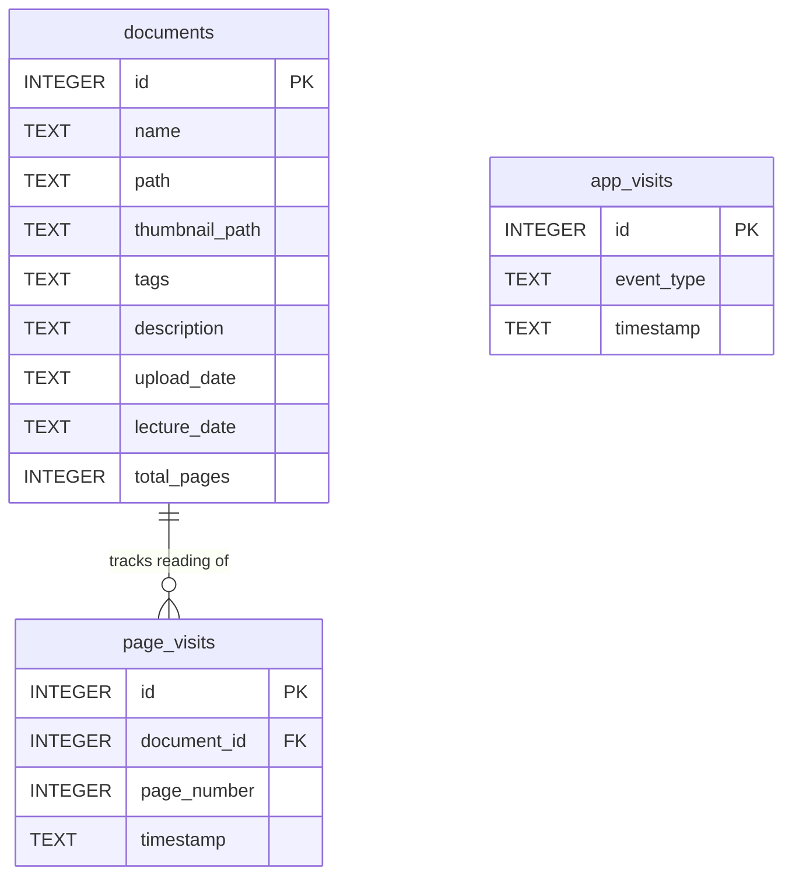

# 🗂️ DocManager — Smart PDF Document Manager

## A Python-web based document management and analytics system taht helps to organize scattered PDFs, enables fast search, and provides insights into user behavior through clickstream analytics.

## Problem Statement

Managing multiple PDFs (notes, lecture notes, research papers, e-books, documents) across a system becomes inefficient when:

-   **No organisation** — PDFs pile up in folders with no tagging or metadata
-   **No fast search** — Manual search takes significant time
-   **No built-in reader** — Opening a PDF requires switching to a separate directory
-   **No progress tracking** — There is no way to know which documents you have read or how far you got
-   **No usage insight** — No visibility into how often you interact with your documents

These problems compound when a collection grows past a handful of files. The result is a library that exists but cannot be used effectively.

This project solves all of the above problems by creating a **centralized document searchable system** with built-in analytics

---

## ✅ Solution

DocManager solves all of the above in a single local web app:

-   **Upload** any PDF with metadata(tags, a description, and an optional lecture date)
-   **Search** pdf instantly by tag (substring match) or by date
-   **Browse** results with auto-generated cover thumbnails
-   **Read** page-by-page directly in the browser — no PDF plugin needed
-   **Track progress** automatically — every page you view is recorded, and reading progress is shown as a percentage
-   **Analyse** clickstream data to track user interactions across our platform.

Everything runs on browser, no accounts, no dependencies outside the machine.

---

## ✨ Features

1.  📤 **PDF Upload**: Upload a PDF with tags, description, and optional lecture date

🖼️ **Auto Thumbnail**: Cover image generated from page 0 of each PDF

🔍 **Smart Search**: Search by tag (LIKE) or date (exact). Results shown with thumbnails

📖 **In-Browser Reader**: Page-by-page reading — PDFs pre-rendered to PNG at 2× resolution

📊 **Analytics Dashboard**: Bar chart of app events + per-document reading progress table

🔐 **Admin Panel** Password-protected full reset of database and file storage

1.  **Document Upload & Storage**

-   Upload PDF files with tags, description, and optional lecture date via UI
-   Store files locally
-   Save metadata in database:
    1.  File name
    2.  Tags
    3.  Description
    4.  Date (Optional)Auto Thumbnail: Cover image generated from page 0 of each PDF

2.  **Smart Search** Search documents using:1. Tags (LIKE)2. Date (exact)

Results shown with thumbnails

This way, we Eliminates manual file browsing

3.  **PDF Viewer**Convert PDF -> Images using PyMuPDFEnables faster rendering in UI
    
4.  **Clickstream Analytics**Tracks user actions like:
    
    1.  Upload
    2.  Search
    3.  Open Document
    4.  Previous
    5.  Next
    6.  Close **Analytics Dashboard**: Bar chart of app events + per-document reading progress table
5.  **Clean storage using Admin Control**Delete all thumbnails, pdfs and images stored in the local storage to clean up the space. Password-protected full reset of database and file storage option is available.
    

---

## 🛠️ Tech Stack

**Frontend**: Streamlit == 1.55.0 Web UI — tabs, session state, file uploader

**Backend**: Python == 3.14.3 Core language

**Database**: SQLite: built-in Local database — zero config

**PDF Processing**: PyMuPDF (fitz) == 1.27.2.2 PDF rendering — page images + page count

**Analytics**: Pandas == 2.3.3 Analytics DataFrames

**Image Processing**: Pillow == 12.1.1 Image processing

**Environment variables**: Python-dotenv == 1.2.2 Load `ADMIN_PASSWORD` from `.env`

---

## 🗄️ Database Design

Three tables are created automatically on first run by `init_db()` in `db/database.py`.



### Table Purpose

-   **`documents`** — one row per uploaded PDF. Stores all metadata plus paths to the saved file and its thumbnail.
-   **`page_visits`** — one row per page view. `COUNT(DISTINCT page_number)` gives unique pages read, which drives the progress percentage.
-   **`app_visits`** — one row per user action. Recorded events: `upload_click`, `search_click`, `open_document`, `prev_page`, `next_page`, `close_reader`. Powers the usage bar chart.

### Search Query Logic

```sql
-- Tag onlySELECT * FROM documents WHERE tags LIKE '%{tag}%'-- Date onlySELECT * FROM documents WHERE lecture_date = '{date}'-- Both (joined with OR)SELECT * FROM documents WHERE tags LIKE '%{tag}%' OR lecture_date = '{date}'
```

> All queries use `?` parameterised placeholders — not string concatenation — preventing SQL injection.

---

### Reading Progress Formula

```
unique_pages = COUNT(DISTINCT page_number) WHERE document_id = Xprogress %   = (unique_pages / total_pages) × 100
```

Revisiting a page does **not** inflate progress — only newly viewed unique pages count.

---

## Installation

1.  Clone Repository `git clone` [https://github.com/pushpaneupane710/DocManager](https://github.com/pushpaneupane710/DocManager) `cd DocManager`
2.  Create Virtual Environment `python -m venv venv source venv/bin/activate`
3.  Install Dependencies `pip install -r requirements.txt`
4.  Run Application `streamlit run appmain.py`

---

## Future Improvements
- PDF compression & Optimization
- Cloud Storage integration
- Advanced search (full-text search)

---
